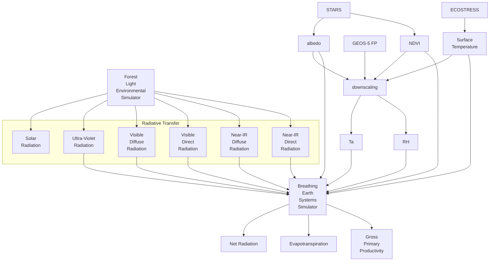

```mermaid
graph TB;
    ST[Surface<br>Temperature]

    GEOS5FP[GEOS-5 FP]

    FLiES[Forest<br>Light<br>Environmental<br>Simulator]

    subgraph RT[Radiative Transfer]
        direction LR
        Rg[Solar<br>Radiation]
        UV[Ultra-Violet<br>Radiation]
        VISdiff[Visible<br>Diffuse<br>Radiation]
        VISdir[Visible<br>Direct<br>Radiation]
        NIRdiff[Near-IR<br>Diffuse<br>Radiation]
        NIRdir[Near-IR<br>Direct<br>Radiation]
    end

    BESS[Breathing<br>Earth<br>Systems<br>Simulator]
    
    Rn[Net Radiation]
    ET[Evapotranspiration]
    GPP[Gross<br>Primary<br>Productivity]

    ECOSTRESS-->ST

    STARS-->albedo
    STARS-->NDVI

    GEOS5FP-->downscaling
    ST-->downscaling
    NDVI-->downscaling
    albedo-->downscaling

    downscaling-->Ta
    downscaling-->RH

    FLiES-->Rg
    FLiES-->UV
    FLiES-->VISdiff
    FLiES-->VISdir
    FLiES-->NIRdiff
    FLiES-->NIRdir

    UV-->BESS
    VISdiff-->BESS
    VISdir-->BESS
    NIRdiff-->BESS
    NIRdir-->BESS
    NDVI-->BESS
    albedo-->BESS
    Ta-->BESS
    RH-->BESS
    ST-->BESS

    BESS-->Rn
    BESS-->ET
    BESS-->GPP
```