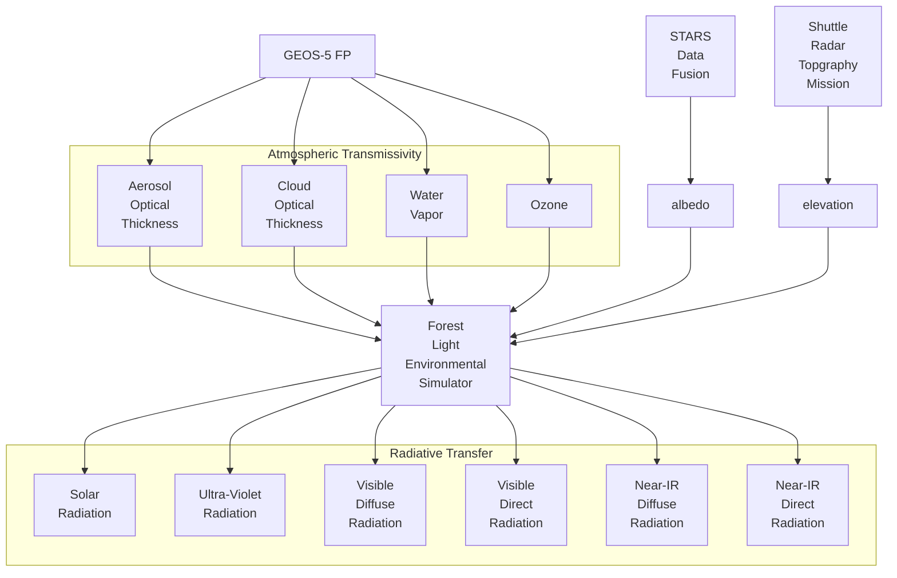

```mermaid
graph TB;
    GEOS5FP[GEOS-5 FP]
    STARS[STARS<br>Data<br>Fusion]
    SRTM[Shuttle<br>Radar<br>Topgraphy<br>Mission]

    subgraph AT[Atmospheric Transmissivity]
        direction LR
        AOT[Aerosol<br>Optical<br>Thickness]
        COT[Cloud<br>Optical<br>Thickness]
        vapor[Water<br>Vapor]
        ozone[Ozone]
    end

    FLiES[Forest<br>Light<br>Environmental<br>Simulator]

    subgraph RT[Radiative Transfer]
        direction LR
        Rg[Solar<br>Radiation]
        UV[Ultra-Violet<br>Radiation]
        VISdiff[Visible<br>Diffuse<br>Radiation]
        VISdir[Visible<br>Direct<br>Radiation]
        NIRdiff[Near-IR<br>Diffuse<br>Radiation]
        NIRdir[Near-IR<br>Direct<br>Radiation]
    end

    GEOS5FP-->AOT
    GEOS5FP-->COT
    GEOS5FP-->vapor
    GEOS5FP-->ozone

    SRTM-->elevation
    STARS-->albedo

    AOT-->FLiES
    COT-->FLiES
    vapor-->FLiES
    ozone-->FLiES
    albedo-->FLiES
    elevation-->FLiES

    FLiES-->Rg
    FLiES-->UV
    FLiES-->VISdiff
    FLiES-->VISdir
    FLiES-->NIRdiff
    FLiES-->NIRdir
```