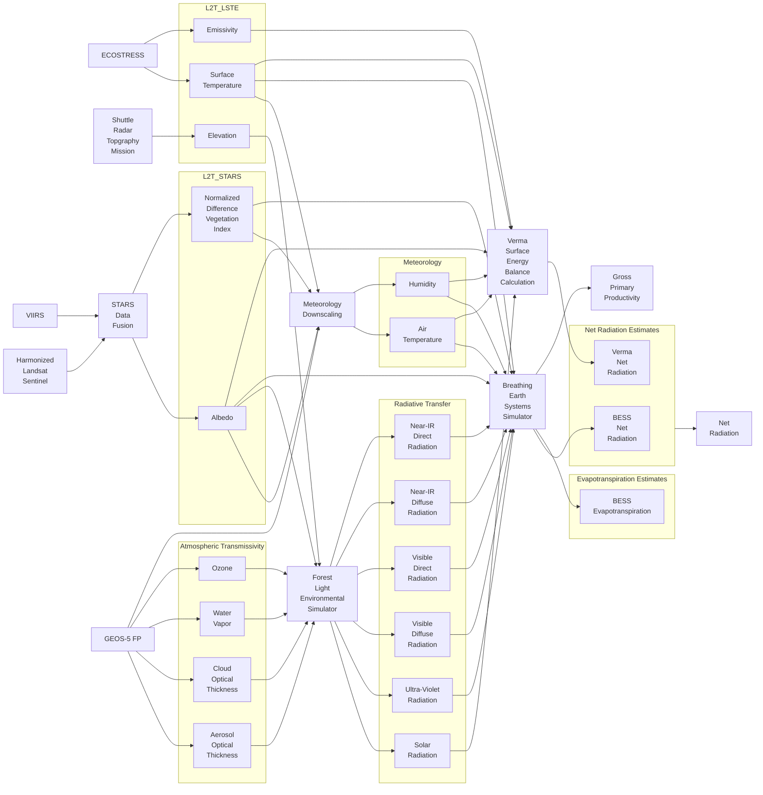

```mermaid
graph LR;
    ECOSTRESS

    subgraph L2T_LSTE
        ST[Surface<br>Temperature]
        emissivity[Emissivity]
        elevation[Elevation]
    end
    
    SRTM[Shuttle<br>Radar<br>Topgraphy<br>Mission]
    
    HLS[Harmonized<br>Landsat<br>Sentinel]
    VIIRS
    STARS[STARS<br>Data<br>Fusion]
    
    subgraph L2T_STARS
        NDVI[Normalized<br>Difference<br>Vegetation<br>Index]
        albedo[Albedo]
    end
    
    GEOS5FP[GEOS-5 FP]
    
    subgraph AT[Atmospheric Transmissivity]
        AOT[Aerosol<br>Optical<br>Thickness]
        COT[Cloud<br>Optical<br>Thickness]
        vapor[Water<br>Vapor]
        ozone[Ozone]
    end

    downscaling[Meteorology<br>Downscaling]
    
    subgraph met[Meteorology]
        Ta[Air<br>Temperature]
        RH[Humidity]
    end
    
    FLiES[Forest<br>Light<br>Environmental<br>Simulator]
    
    subgraph RT[Radiative Transfer]
        Rg[Solar<br>Radiation]
        UV[Ultra-Violet<br>Radiation]
        VISdiff[Visible<br>Diffuse<br>Radiation]
        VISdir[Visible<br>Direct<br>Radiation]
        NIRdiff[Near-IR<br>Diffuse<br>Radiation]
        NIRdir[Near-IR<br>Direct<br>Radiation]
    end
    
    Verma[Verma<br>Surface<br>Energy<br>Balance<br>Calculation]

    BESS[Breathing<br>Earth<br>Systems<br>Simulator]

    subgraph Rn_estimates[Net Radiation Estimates]
        BESS_Rn[BESS<br>Net<br>Radiation]
        Verma_Rn[Verma<br>Net<br>Radiation]
    end

    Rn[Net<br>Radiation]

    subgraph ET[Evapotranspiration Estimates]
        BESS_ET[BESS<br>Evapotranspiration]
    end

    GPP[Gross<br>Primary<br>Productivity]

    ECOSTRESS-->ST
    ECOSTRESS-->emissivity

    SRTM-->elevation
    
    HLS-->STARS
    VIIRS-->STARS
    
    GEOS5FP-->AOT
    GEOS5FP-->COT
    GEOS5FP-->vapor
    GEOS5FP-->ozone

    GEOS5FP-->downscaling
    ST-->downscaling
    NDVI-->downscaling
    albedo-->downscaling

    downscaling-->Ta
    downscaling-->RH
    
    STARS-->albedo
    STARS-->NDVI

    AOT-->FLiES
    COT-->FLiES
    vapor-->FLiES
    ozone-->FLiES
    albedo-->FLiES
    elevation-->FLiES

    FLiES-->Rg
    FLiES-->UV
    FLiES-->VISdiff
    FLiES-->VISdir
    FLiES-->NIRdiff
    FLiES-->NIRdir

    UV-->BESS
    VISdiff-->BESS
    VISdir-->BESS
    NIRdiff-->BESS
    NIRdir-->BESS
    NDVI-->BESS
    albedo-->BESS
    Ta-->BESS
    RH-->BESS
    ST-->BESS

    BESS-->BESS_Rn
    BESS-->BESS_ET
    BESS-->GPP

    ST-->Verma
    emissivity-->Verma
    albedo-->Verma
    Rg-->Verma
    Ta-->Verma
    RH-->Verma

    Verma-->Verma_Rn

    Rn_estimates-->Rn
```